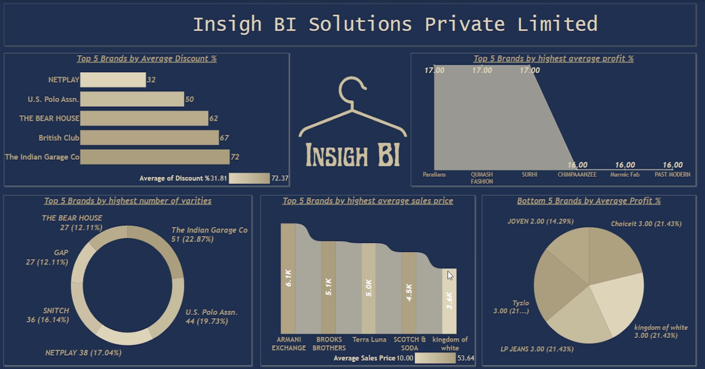

# 👕 Men’s Retail Analytics Dashboard (Power BI + BigQuery)

> **Tools Used:** Power BI, Google BigQuery, Power Query, DAX  
> **Project Type:** Business Intelligence | **Domain:** Retail Analytics

---

## 📌 Overview

This project analyzes a branded men’s t-shirt sales dataset to generate meaningful business insights. It identifies the top and bottom-performing brands based on profit %, discount %, and variety using a fully cloud-integrated data pipeline built on BigQuery and Power BI.

---

## 🎯 Objectives

- Analyze brand-wise performance based on sales, pricing, profit %, discount %, and product variety  
- Clean raw data using Power Query and transform it into a reporting-ready model  
- Use DAX to derive KPIs like Cost Price, Discount %, and Profit %  
- Build a professional and interactive Power BI dashboard connected to BigQuery  

---

## 🛠️ Tools & Techniques

- **Google BigQuery** – Cloud data warehouse used to upload and query the raw CSV dataset  
- **Power BI** – Used for visualization and data modeling  
- **Power Query** – Performed data cleaning, header fixing, NaN handling, type conversion  
- **DAX** – Created derived columns like Profit %, Discount %, and Cost Price  
- **Canva** – Designed background images for the dashboards  

---

## 🔄 Workflow Summary

1. Uploaded `Men+Tshirt.csv` into BigQuery  
2. Ran a few queries to explore the dataset  
3. Connected BigQuery to Power BI  
4. In Power Query:
   - Used first row as headers  
   - Removed NaN from sales  
   - Converted columns to proper data types  
5. Created a `Factor` column:  
   `= IF(Original Price is blank, 1.5, 0)`  
6. Multiplied sales with factor to create estimated marked price  
7. Created conditional column:  
   `= IF(Marked Price is blank, use Sales * Factor, else use existing Marked Price)`  
8. Deleted helper columns  
9. Added DAX Calculated Columns:  
   ```DAX
   Profit % = RANDBETWEEN(2, 17)  
   Cost Price = DIVIDE(100 * [Sales Price], 100 + [Profit %])  
   Discount % = DIVIDE([Marked Price] - [Sales Price], [Marked Price]) * 100  
   ```  

---

## 📊 Dashboard Overview

### 🟦 Page 1: Brand Catalog Overview

Custom-designed landing page using Canva to display available brands in a clean layout using multi-row card.


---

### 🟩 Page 2: Brand KPI Insights

This page contains all key analytics and visuals based on metrics:

✅ Top 5 Brands by:
- Average Discount %
- Average Profit %
- Average Sales Price
- Product Variety

🔻 Bottom 5 Brands by:
- Lowest Profit %

📈 Visual Types Used:
- KPI Cards
- Bar Charts
- Pie & Donut Charts
- Slicers for interaction



---

### 📷 Optional Full Dashboard View

If you have a full screenshot combining both pages, show it here:


---

## 📈 Key Business Insights

🏷️ The Indian Garage Co. had the highest average discount at ~72%  
💰 ARMANI Exchange had the highest average sales price (~6.1K)  
📦 U.S. Polo Assn. and Bear House had the largest product variety  
⚠️ JOVEN, Choiceit, and LP Jeans had the lowest profit margins, signaling poor ROI  

---

## 💡 Skills Demonstrated

- End-to-end BI workflow from cloud data ingestion (BigQuery) to insightful reporting (Power BI)  
- Real-world data cleaning and wrangling using Power Query  
- Writing DAX logic for business KPIs  
- Visual storytelling using KPI dashboards  
- Understanding of retail performance metrics and business implications  

---

## 📂 File Structure

```
├── README.md  
├── page1.jpeg  
├── page2.png  

```

---

## 🙋‍♂️ About Me

**Prince**  
Final-year CSE student at Panjab University  
Aspiring Data Analyst | Product & BI Enthusiast  


---

⭐ If this project helped you, feel free to star the repo and connect with me!
